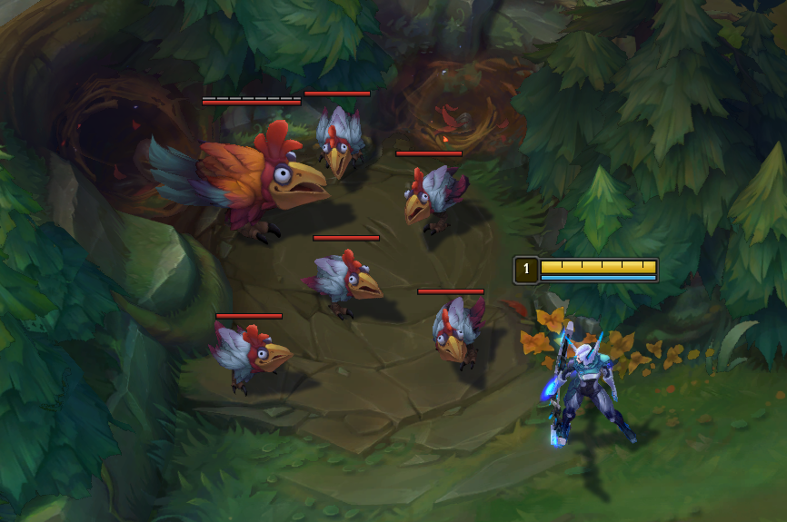

# LeagueSkinChanger
LeagueSkinChanger is internal skin changer for League of Legends.

- Use any available skin for your champion or any other in game, enemy and ally
- Automatic skins database update
- Change skin for lane minions
- In-game configuration with <a href="https://github.com/ocornut/imgui">ImGui</a>
- Configure your jungle mobs skins like baron, red, blue
- Change skins anytime and unlimited times in single game
- Support for spectator mode
- <a href="https://github.com/nlohmann/json">JSON</a> based configuration saving & loading

# License
<b>This project is licensed under the MIT license</b>

See the "<a href="https://github.com/b3akers/LeagueSkinChanger/blob/master/LICENSE">LICENSE</a>" file for more details.
